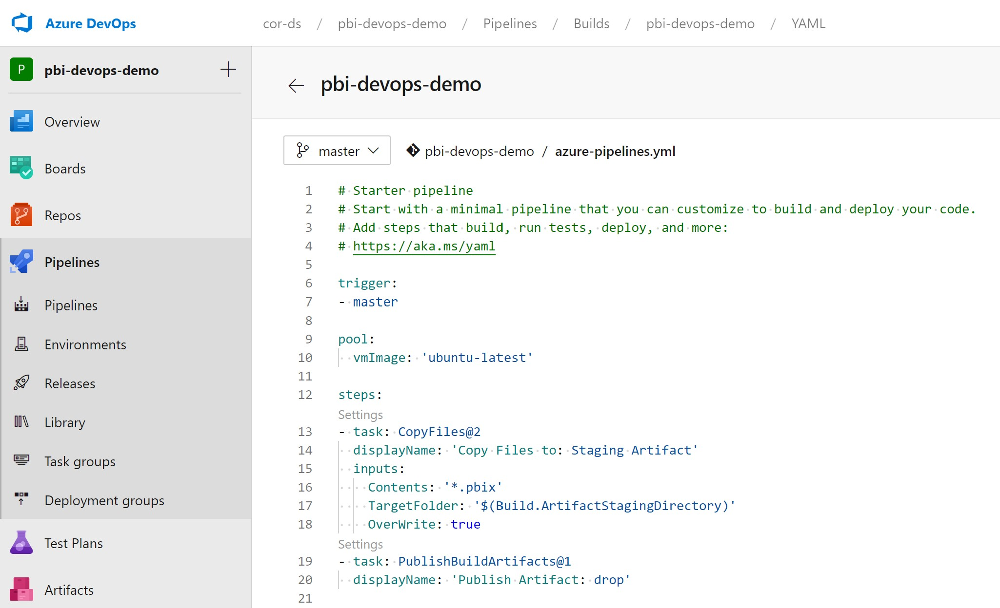
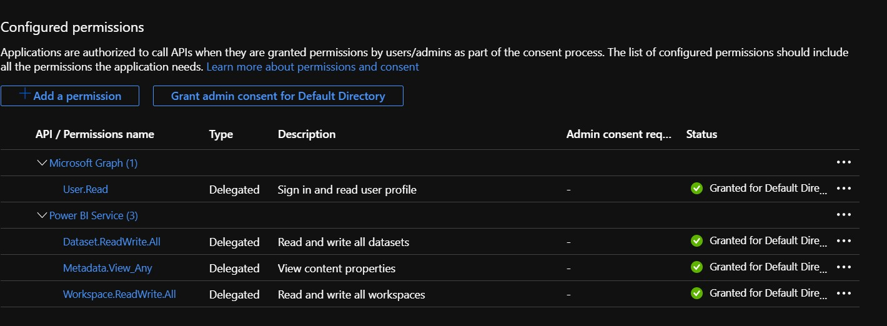
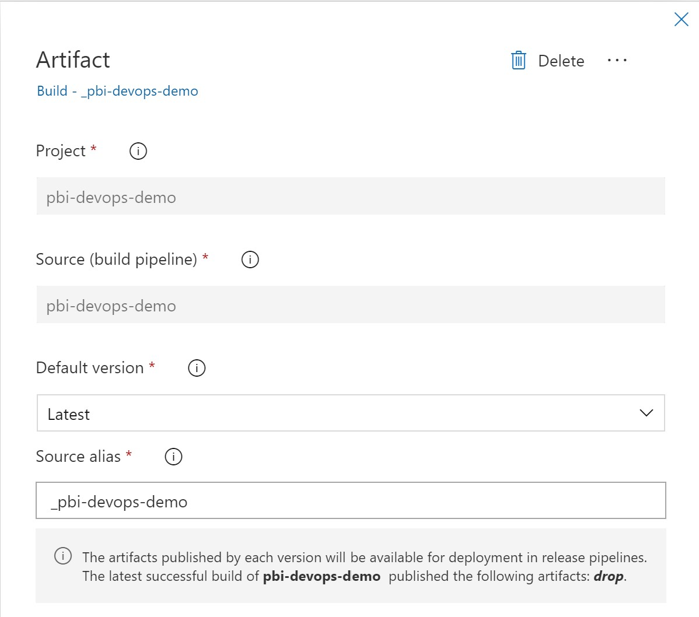
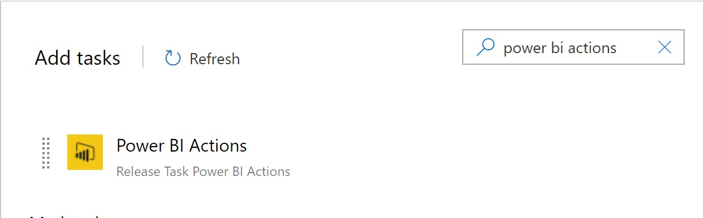
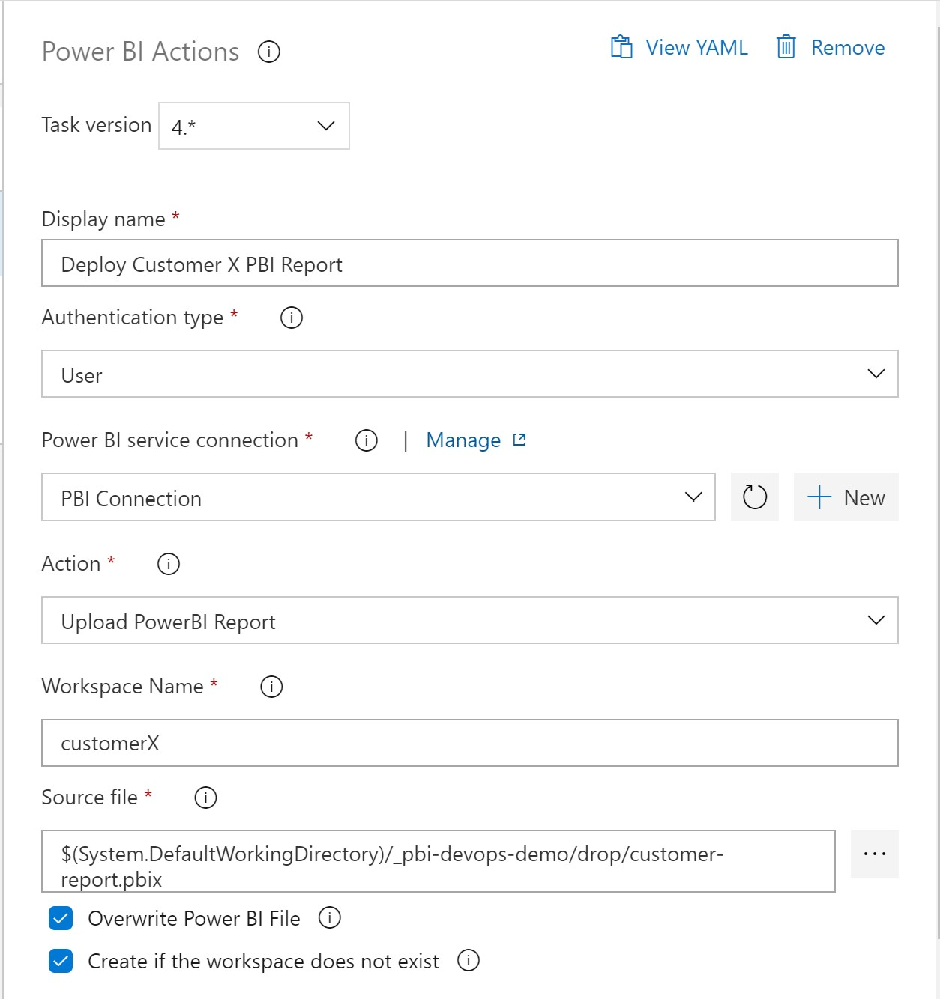
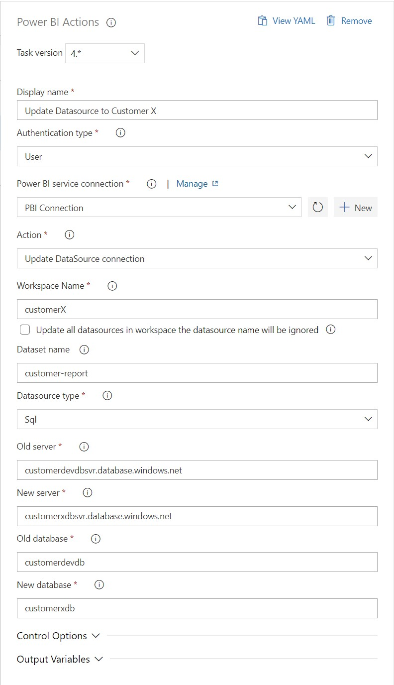
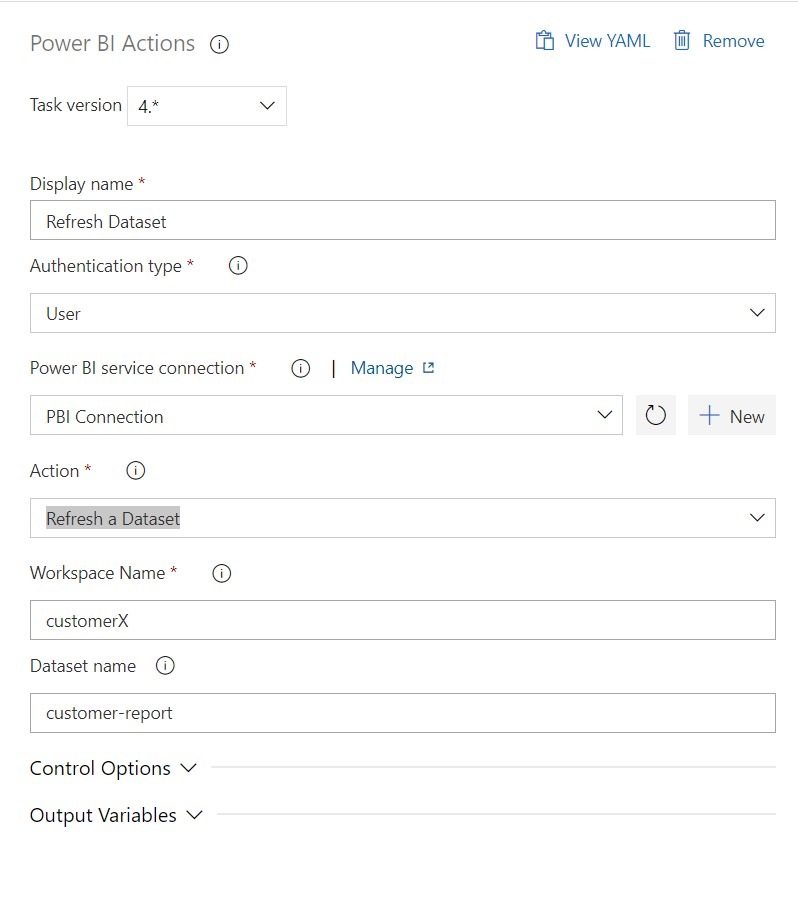
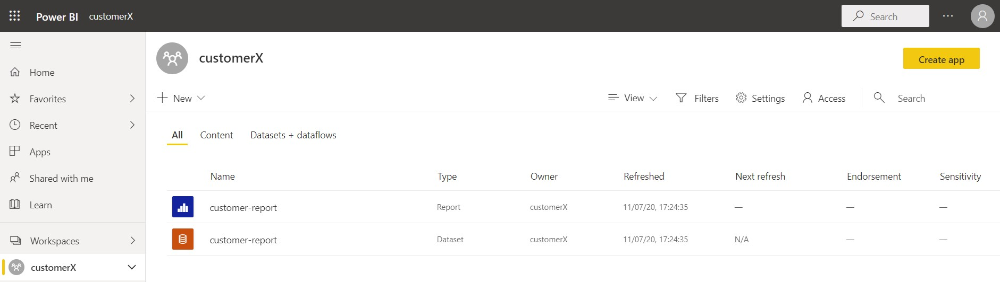
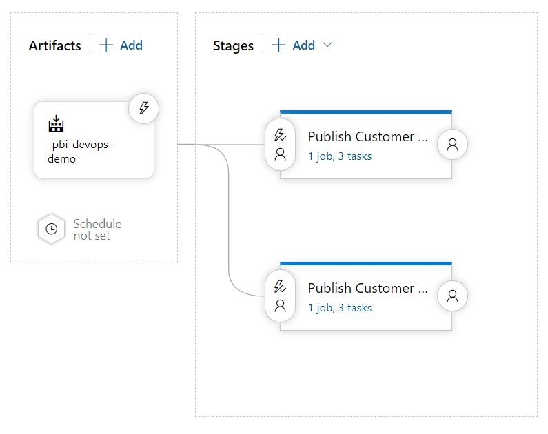

# Deploying Power BI reports using Azure Devops
In this article, we walk through a set up using  [Power BI Service](https://powerbi.microsoft.com/p) and [Azure Devops](https://dev.azure.com/) to deploy a Power BI Report (.pbix file) to different workspaces; each with a different data source.  

## Key Concepts
- Each Power BI Service workspace represents a separate environment. 
- Each workspace points to a separate data source.
- Each data source is based on the same schema.
- The same Power BI report is deployed to different workspaces.  
 
## Setting up the Data Sources
For this sample, we assume a *workspace-per-customer* approach and create three databases and three Power BI Service workspaces.  The default *My workspace* represents the development envirionment to build and test the report while the workspaces X and Y represents the production environments for customer X and Y respectively.    

| Workspace | Datasoure |
| -- | -- |
| My workspace | customerdevdbsvr; customerdevdb |
| customerX | customerxdbsvr; customerxdb |
| customerY | customerydbsvr; customerxdb |

1. Sign into your [Azure portal](https://portal.azure.com), and create a new Azure sql database server, *customerdevdbsvr* with a database, *customerdevdb*.
2. Connect to the *customerdevdb* database and execute the [customerdevdb.sql](./databases/customerDevdb.sql) script to create a populated *Customer* table. 
3. Repeat steps 1 and 2 to create a customer X database (server: *customerXdbsvr*, database: *customerxdb*) and run the [customerXdb.sql](./databases/customerXdb.sql) script. 
4. Lastly, repeat steps 1 and 2 to create a customer Y database(server: *customerydbsvr*, database: *customerydb*) and run the [customerYdb.sql](./databases/customerYdb.sql) script.

As a quick check, query the customer tables of all three databases and you will notice the dev database holds customers *Customers A, B, C*..., while databases customer X and Y contain males and females names respectively. 

## Setting up the Azure Devops CI/CD pipelines
10. Sign into your [Azure Devops](https://dev.azure.com) instance and create a new devops project called *pbi-devops*.
11. Add the [customer-report.pbix](./pbix/customer-report.pbix) to the project's repo. 
12. Add the *Power BI Action* task to your Azure Devops instance (https://marketplace.visualstudio.com/items?itemName=maikvandergaag.maikvandergaag-power-bi-actions).

### Create a Build Pipeline
13. Create a new Build Pipeline in Azure Devops that copies and publishes the .pbix file using YAML.
```
trigger:
- master

pool:
  vmImage: 'ubuntu-latest'

steps:
- task: CopyFiles@2
  displayName: 'Copy Files to: Staging Artifact'
  inputs:
    Contents: '*.pbix'
    TargetFolder: '$(Build.ArtifactStagingDirectory)'
    OverWrite: true
- task: PublishBuildArtifacts@1
  displayName: 'Publish Artifact: drop'
```


### Register an Azure AD App
For this sample, we will be using a *Master Account* to access the underlying Power BI APIs required by the DevOps Release Pipeline Tasks.  To setup a Service Principal (SPN) instead, refer to this [MS Doc](https://docs.microsoft.com/en-us/power-bi/developer/embedded/embed-service-principal).

**Important:** Make sure to create the App Registration in the same Azure AD tenant/organization of the Power BI Service Workspace.  As a quick test, login to Power BI Service with the account you intend to use as the Master Account.    

12. Sign in to your Azure Portal.
13. Register an Azure AD application as documented [here](https://docs.microsoft.com/en-us/azure/active-directory/develop/quickstart-register-app) and capture the Application/Client ID.
14. Click *API Permissions*, click *+ Add a permission*, select the *Power BI Service* from the list of Microsoft APIs.
15. Select *Delegated Permissions* and select the **Dataset.ReadWrite.All**, **Workspace.ReadWrite.All** and **Metadata.View_Any**.
16. Click *Grant admin consent for Default Directory* and click *Yes*.
    


### Create a Release Pipeline
16. Create a new Release pipeline.
17. Add an artifact using the build pipeline source.
    
14. Add a new Stage with an *Empty Job* and name it **Publish Customer X PBI Reports**.
15. Click on the Tasks links of the Stage and click on the "+" to add new Task to the Agent.
    

16. Search for the *Power BI Actions* in the Task search bar and add it to your Azure Devops.
    

17. Enter the following for the Task to <ins>upload the report</ins> to the workspace:
  - Display Name: **Deploy Customer X PBI Report**
  - Authenication: **User** (if using SPN, than select Service Principal)
  - Power BI service connection: 
    - Select *+ New* 
    - Enter the client Id from step 12, 
    - Enter a username and password of your Master Account
    - Enter *Service connection name*: **PBI Connection**
  - Action: **Upload PowerBI Report** 
  - Workspace: **customerX**
  - Source file: **Browse and select the *customer-report.pbix* file in the Linked artifacts**


18.  Save the Pipeline and add another *Power BI Actions* Task to <ins>update the report's datasource</ins>:
  - Display Name: **Update Datasource to Customer X**
  - Authenication: **User** (if using SPN, than select Service Principal)
  - Power BI service connection: **PBI Connection**
  - Action: **Update DataSource connection** 
  - Workspace: **customerX**
  - Dataset name: **customer-report**
  - Datasource type: **Sql**
  - Old server: **customerdevdbsvr.database.windows.net**
  - New server: **customerxdbsvr.database.windows.net**
  - Old database: **customerdevdb**
  - New database: **customerxdb** 



18. Save the Pipeline and add another *Power BI Actions* Task to <ins>refresh the report's dataset</ins>:
  - Display Name: **Refresh Dataset**
  - Authenication: **User** (if using SPN, than select Service Principal)
  - Power BI service connection: **Select the *Service Connection* configured above**
  - Action: **Refresh a Dataset** 
  - Workspace: **customerX**
  - Dataset name: **customer-report**



19. Save the Pipeline.
20. Finally, run the Build and Release pipelines.
21. If pipelines were succesful, sign in to your Power BI Workspace and verify the report and its dataset.


22. Repeat steps 13 through 21 but for Customer Y with the following values:
    - Display Name: ***Change "Customer X" to "Customer Y"***  
    - Workspace: **customery**
    - New server: **customerydbsvr.database.windows.net**
    - New database: **customerydb**
23. The final Release pipeline should look similar to this.
 

### References:
- *PowerBI - CICD using Azure DevOps* (https://community.powerbi.com/t5/Community-Blog/PowerBI-CICD-using-Azure-DevOps/ba-p/769244)
  